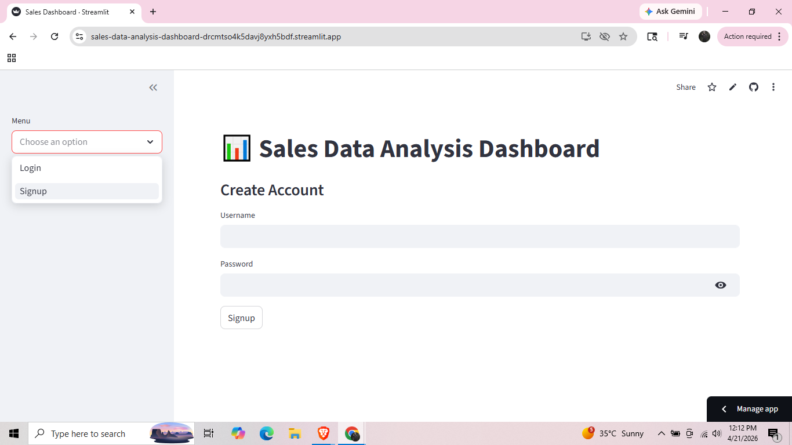
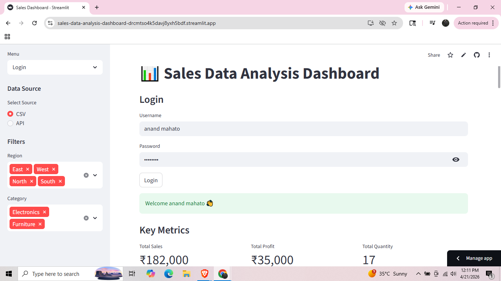
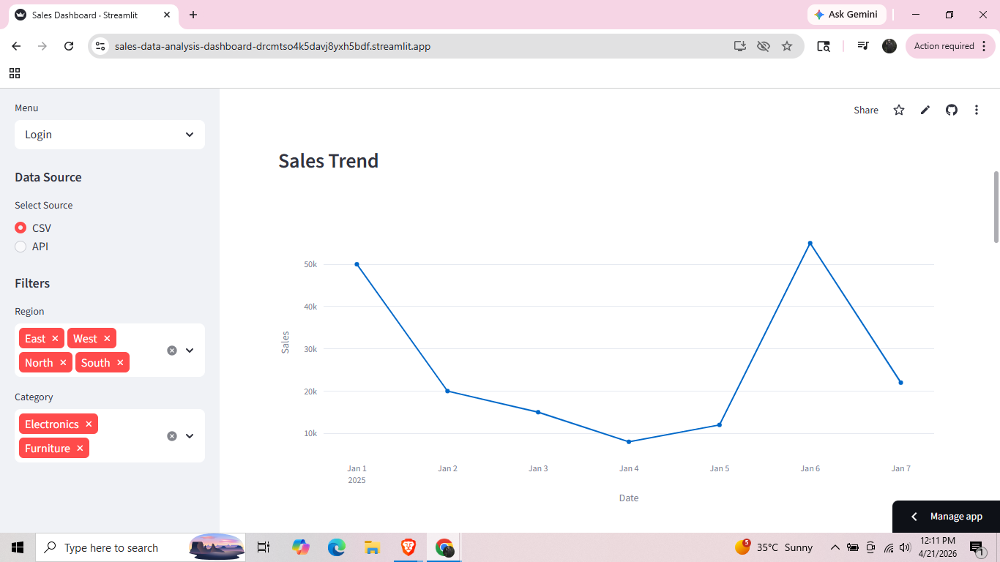
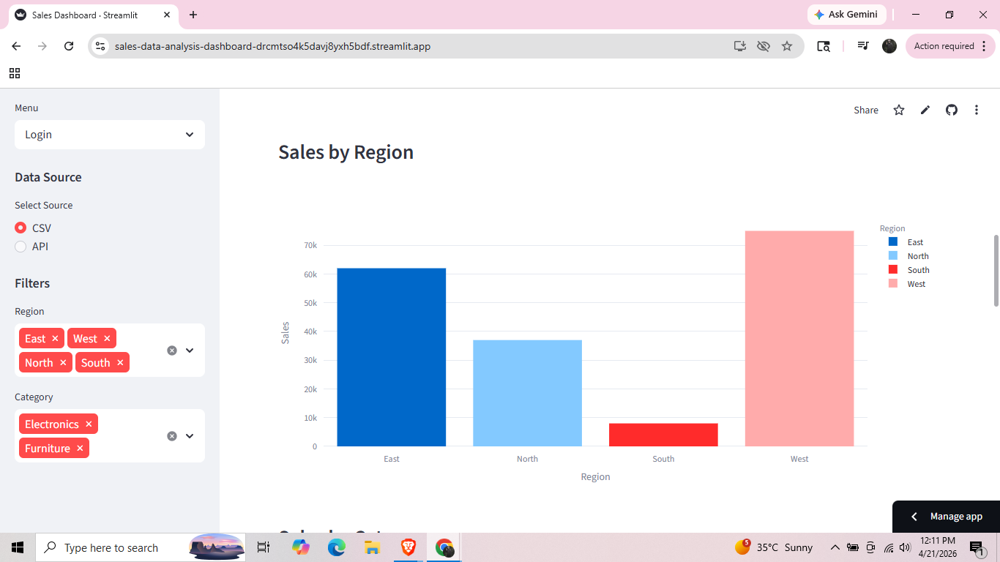
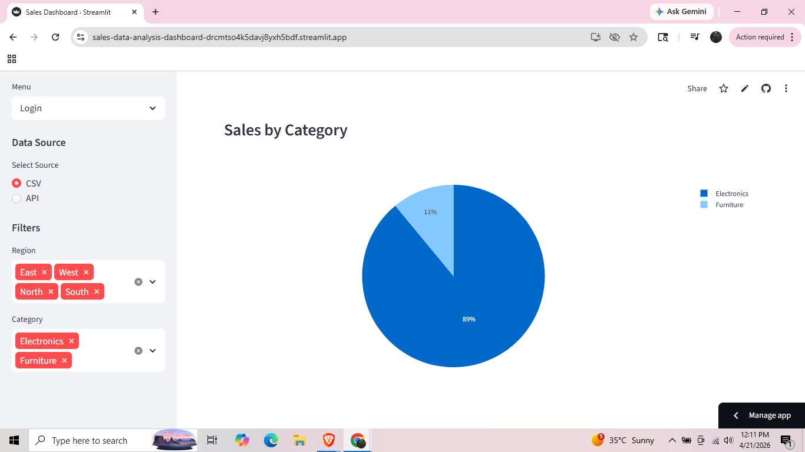
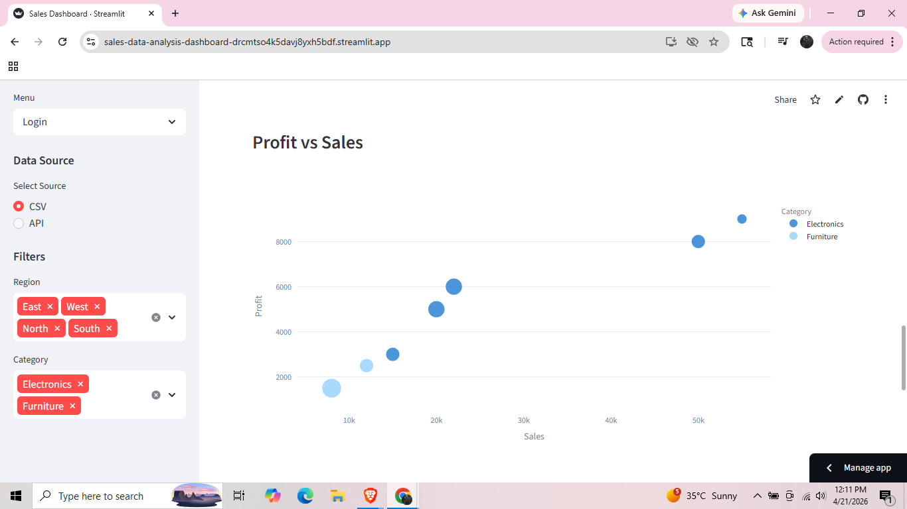
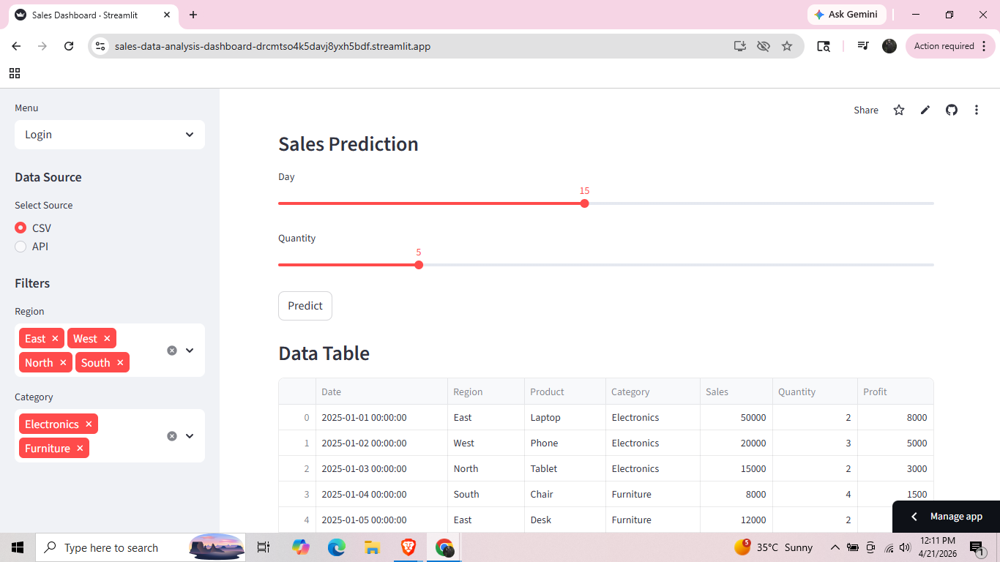
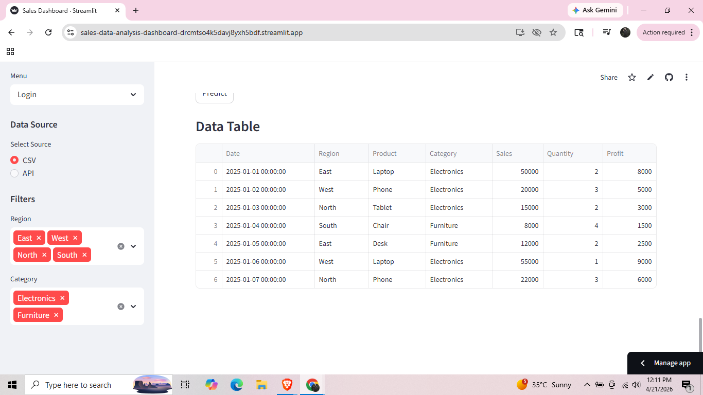

# 📊 Sales Data Analysis Dashboard

🚀 An end-to-end **Sales Analytics & Prediction System** built using modern data tools. This project provides **interactive dashboards, machine learning-based forecasting, API integration, and authentication system**.

---

## 🔗 Repository Link

👉 https://github.com/IamAnandMahato/Sales-Data-Analysis-Dashboard

---

## 🌐 Live Demo

👉 (Add your deployed Streamlit link here)

---

## 🔥 Key Features

* 📈 Interactive Dashboard (Streamlit + Plotly)
* 🤖 Machine Learning (Sales Prediction using Linear Regression)
* 🌐 Live API Data Integration
* 🔐 Login & Signup Authentication System
* 📊 Dynamic Filters & KPI Metrics
* 📉 Data Visualization (Charts & Graphs)
* ☁️ Deployment Ready

---

## 🧠 Tech Stack

| Category         | Technologies |
| ---------------- | ------------ |
| Frontend         | Streamlit    |
| Backend          | Python       |
| Data Analysis    | Pandas       |
| Visualization    | Plotly       |
| Machine Learning | Scikit-learn |
| API              | Requests     |
| Version Control  | Git          |

---

## 📁 Project Structure

```id="4z6dyu"
Sales-Data-Analysis-Dashboard/
│
├── src/
│   ├── app.py
│   ├── auth.py
│   ├── ml_model.py
│   └── api_data.py
│
├── data/
│   └── sales_data.csv
│
├── assets/
│   ├── dashboard.png
│   ├── data_table.png
│   ├── login_signup.png
│   ├── profit_vs_sales.png
│   ├── sales_by_category.png
│   ├── sales_by_region.png
│   ├── sales_prediction.png
│   └── sales_trend.png
│
├── run.py
├── requirements.txt
├── README.md
└── .gitignore
```

---

## 📊 Dashboard Screenshots

### 🔐 Login & Signup



---

### 📈 Dashboard Overview



---

### 📅 Sales Trend



---

### 🌍 Sales by Region



---

### 📦 Sales by Category



---

### 📊 Profit vs Sales Analysis



---

### 🤖 Sales Prediction



---

### 📋 Data Table View



---

## ⚙️ Setup Instructions

### 1️⃣ Clone Repository

```bash id="01id30"
git clone https://github.com/IamAnandMahato/Sales-Data-Analysis-Dashboard.git
cd Sales-Data-Analysis-Dashboard
```

---

### 2️⃣ Install Dependencies

```bash id="8v3p1y"
pip install -r requirements.txt
```

---

### 3️⃣ Run Project

```bash id="4t8drx"
streamlit run src/app.py
```

---

## 🤖 Machine Learning

* Model: Linear Regression
* Input Features: Day, Quantity
* Output: Predicted Sales

✔ Helps forecast future sales
✔ Supports data-driven decision making

---

## 🌐 API Integration

* Fetches real-time sales data
* Can be extended to IoT / business systems

---

## 🔐 Authentication System

* Login & Signup functionality
* Password hashing (SHA-256)
* SQLite database

---

## 📈 Insights Provided

* Sales trends over time
* Region-wise analysis
* Category-wise performance
* Profit vs Sales relationship

---

## ☁️ Deployment

Deployed on Streamlit Cloud
(Add your live link above)

---

## 💼 Resume Description

**Developed a full-stack Sales Data Analysis Dashboard with machine learning-based prediction, real-time API integration, and secure authentication, enabling actionable business insights.**

---

## 🔮 Future Improvements

* Advanced ML (ARIMA / LSTM)
* Role-based authentication
* Real-time alerts
* Mobile app integration

---

## 👨‍💻 Author

**Anand Mahato**
B.Tech CSE (2026)

---

## ⭐ Support

If you like this project:

* Star ⭐ the repo
* Fork 🍴 it
* Share 🔗

---
